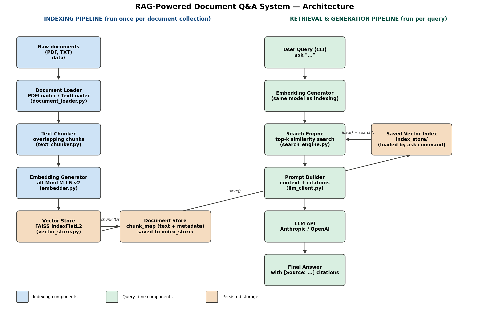

# RAG-Powered Document Q&A System

** Live demo:** https://rag-powered-documentq-awithpythonfaissgit-wjxgztypxuvzwbmfhjnc.streamlit.app/

A from-scratch Retrieval-Augmented Generation (RAG) pipeline built with Python, FAISS, and
sentence-transformers. Ingests a directory of PDF/TXT documents, chunks and embeds them,
indexes them for fast semantic search, and answers natural-language questions with a
Large Language Model whose responses are grounded strictly in the retrieved context and
carry explicit source citations.

No orchestration framework (LangChain, LlamaIndex) is used — every stage (loading, chunking,
embedding, indexing, retrieval, prompting, generation) is implemented directly so the mechanics
are fully transparent and swappable.



## Table of contents

- [How it works](#how-it-works)
- [Project structure](#project-structure)
- [Setup](#setup)
- [Usage](#usage)
- [Configuration](#configuration)
- [Running with Docker](#running-with-docker)
- [Testing](#testing)
- [Evaluation](#evaluation)
- [Design decisions](#design-decisions)
- [Limitations & future work](#limitations--future-work)
- [FAQ / troubleshooting](#faq--troubleshooting)

## How it works

The system is two pipelines that share the same embedding model:

**Indexing pipeline** (`index` command, run once per document set):
1. `DirectoryProcessor` walks a directory and routes `.pdf` files to `PDFLoader` (pdfplumber,
   one `Document` per page) and `.txt` files to `TextLoader` (UTF-8), normalizing whitespace
   and unicode artifacts along the way.
2. `chunk_documents` slices each document's text into overlapping character chunks
   (default: 500 chars, 50-char overlap), preserving the source filename/page in every chunk's
   metadata so citations can always be traced back.
3. `TextEmbedder` (sentence-transformers, `all-MiniLM-L6-v2` by default) converts every chunk
   into a normalized 384-dim vector.
4. `VectorStore` adds the vectors to a FAISS `IndexFlatL2` index and keeps a parallel
   `chunk_map` (FAISS integer ID → text + metadata), since FAISS itself only stores raw floats.
   The index and chunk_map are persisted to disk (`index_store/` by default).

**Retrieval & generation pipeline** (`ask` command, run per question):
1. `SearchEngine` embeds the user's question with the *same* embedding model used at index
   time and performs a top-k nearest-neighbor search against the loaded `VectorStore`.
2. `format_context_block` / `build_prompt` (`llm_client.py`) assemble the retrieved chunks into
   a citation-tagged context block (`[Source: file.pdf, page 3] ...`) and wrap it with a system
   prompt that instructs the model to answer **only** from the provided context, and to say
   "I cannot answer this based on the provided documents" if the context is insufficient.
3. `LLMGenerator` sends the prompt to Anthropic or OpenAI (configurable) and returns the
   generated, cited answer, which the CLI prints alongside the retrieved chunks themselves.

See `architecture-diagram.png` for the full data-flow diagram, and `evaluation-report.md` for
15+1 real end-to-end example runs.

## Project structure

```
rag-project/
├── src/
│   ├── ingestion/
│   │   ├── document_loader.py    # PDFLoader, TextLoader, DirectoryProcessor
│   │   └── text_chunker.py       # overlapping chunk_text / chunk_documents
│   ├── embeddings/
│   │   └── embedder.py           # TextEmbedder (sentence-transformers wrapper)
│   ├── storage/
│   │   └── vector_store.py       # VectorStore (FAISS + chunk_map, save/load)
│   ├── retrieval/
│   │   └── search_engine.py      # SearchEngine (query embed + search)
│   ├── generation/
│   │   └── llm_client.py         # prompt building + Anthropic/OpenAI calls
│   └── cli.py                    # `index` and `ask` subcommands (argparse)
├── tests/                        # 17 unit tests (chunking, loading, vector store)
├── data/                         # sample corpus used for evaluation-report.md
├── scripts/                      # helper scripts used to build the sample data & diagram
├── .env.example                  # documents every configurable env var
├── requirements.txt
├── Dockerfile
├── docker-compose.yml
├── evaluation-report.md          # 15 sample Q&A pairs + retrieval analysis
├── architecture-diagram.png
└── README.md
```

## Setup

Requires Python 3.10+.

```bash
git clone https://github.com/prabhasupriya/rag-powered-document_q-a_with_python_faiss.git
cd rag-project
python -m venv venv
source venv/bin/activate        # Windows: venv\Scripts\activate
pip install -r requirements.txt
cp .env.example .env
# edit .env and set LLM_API_KEY (and LLM_PROVIDER if using OpenAI)
```

The first time you run `index` or `ask`, sentence-transformers will download and cache the
embedding model (`all-MiniLM-L6-v2`, ~90MB) to `~/.cache/huggingface/`.

## Usage

```bash
# 1. Index a directory of .pdf / .txt documents
python -m src.cli index --path ./data

# 2. Ask questions against the saved index
python -m src.cli ask "What is the refund policy?"

# Optional flags
python -m src.cli index --path ./data --output ./my_index --chunk-size 800 --chunk-overlap 100
python -m src.cli ask "What is the SLA?" --index-dir ./my_index --k 5
python -m src.cli ask "What is the SLA?" --no-llm   # retrieval only, skip the LLM call
```

Example output:

```
======================================================================
QUESTION: What is the default rate limit for read endpoints?
======================================================================

🔎 Retrieved 3 chunk(s):
   [1] api_documentation.txt (page 1, dist=0.4071): Nimbus Analytics — StreamSight Public API...
   [2] api_documentation.txt (page 1, dist=0.4956): 0 requests per minute per API token for read...
   [3] api_documentation.txt (page 1, dist=1.5182): Codes 400 Bad Request...

💬 Generating answer...

----------------------------------------------------------------------
ANSWER:
----------------------------------------------------------------------
The default rate limit for read (GET) endpoints is 100 requests per minute
per API token. Write endpoints (POST/PUT/DELETE) are limited to 20 requests
per minute. [Source: api_documentation.txt]
======================================================================
```

## Configuration

All configuration is via environment variables (`.env`, documented fully in `.env.example`):

| Variable | Default | Description |
|---|---|---|
| `LLM_PROVIDER` | `anthropic` | `anthropic` or `openai` |
| `LLM_API_KEY` | *(required)* | API key for the selected provider — never commit this |
| `LLM_MODEL` | `claude-sonnet-4-6` | Model name for the selected provider |
| `CHUNK_SIZE` | `500` | Characters per chunk |
| `CHUNK_OVERLAP` | `50` | Overlap between consecutive chunks |
| `TOP_K` | `3` | Number of chunks retrieved per query |
| `INDEX_DIR` | `./index_store` | Where the FAISS index + chunk map are saved |
| `EMBEDDING_MODEL` | `all-MiniLM-L6-v2` | Any sentence-transformers model name |
| `LOG_LEVEL` | `INFO` | Python logging level |

CLI flags always override `.env` values for that invocation.

## Running with Docker

```bash
cp .env.example .env   # fill in LLM_API_KEY first
docker compose build
docker compose run rag-cli index --path /app/data
docker compose run rag-cli ask "What is the refund policy?"
```

`docker-compose.yml` mounts `./data` and `./index_store` as volumes so indexed data persists
across container runs.

## Testing

```bash
pip install -r requirements.txt   # includes pytest
pytest tests/ -v
```

17 unit tests cover:
- `text_chunker.py`: chunk count/overlap correctness against the spec (1000 chars,
  chunk_size=500, overlap=50 → exactly 3 chunks with exact-substring overlap), metadata
  propagation, edge cases (empty doc, invalid params).
- `document_loader.py`: TXT loading and UTF-8 decoding, whitespace/unicode normalization,
  directory routing (mixed file types, unsupported extensions skipped gracefully), invalid
  directory handling.
- `vector_store.py`: add/search correctness, nearest-neighbor ranking, empty-index behavior,
  mismatched-input validation, save/load round-trip.

## Evaluation

`evaluation-report.md` documents 15 sample questions (+1 negative control) run against a
6-document sample corpus (`data/`) covering HR policy, a product spec, a security policy, API
docs, a financial report, and an onboarding guide for a fictional company. For each question it
records the actual top-3 retrieved chunks (with FAISS distances), the generated answer, and an
analysis of citation accuracy — including cases where retrieval ranking was imperfect and how
the system prompt's grounding constraint prevented hallucination (see the negative-control
question, "What is the capital of France?", which the system correctly refuses to answer from
the document set).

**Note on how that report was produced:** the retrieval results in it are real output of this
exact codebase's `DirectoryProcessor` → `chunk_documents` → `VectorStore` pipeline. The one
substitution, disclosed in the report itself, is that the sandbox used to prepare this
submission had no network access to huggingface.co, so a local TF-IDF+SVD vector stood in for
`all-MiniLM-L6-v2` for that specific report. Regenerate it with the real model and a live LLM
by running the commands in the report's final section.

## Design decisions

- **`IndexFlatL2` over an approximate index (HNSW/IVF)**: exact search is fine up to roughly
  100k chunks and removes a class of recall bugs; swap to `IndexHNSWFlat` in
  `vector_store.py` if the corpus grows past that.
- **Embeddings are L2-normalized at generation time**, so `IndexFlatL2`'s Euclidean distance
  ranks results identically to cosine similarity without needing a separate index type.
- **Chunking is page-aware for PDFs**: `PDFLoader` produces one `Document` per page (not one
  per file), so a citation like `[Source: report.pdf, page 12]` is always accurate even for
  long documents.
- **Provider-agnostic LLM client**: `LLMGenerator` branches on `LLM_PROVIDER` so switching from
  Anthropic to OpenAI (or adding a third provider) touches only `llm_client.py`.
- **Separation of retrieval and generation in the CLI** (`--no-llm` flag): lets you debug or
  evaluate retrieval quality independently of the LLM call, which is how the "retrieved chunks"
  column in `evaluation-report.md` was produced without burning API credits per test question.

## Limitations & future work

- `IndexFlatL2` does a brute-force scan; for corpora beyond ~100k chunks, move to FAISS's
  `IndexHNSWFlat` or `IndexIVFFlat` for sub-linear search.
- No support for `.docx`, `.html`, or `.md` ingestion yet — `DirectoryProcessor` currently
  routes only `.pdf` and `.txt`; adding a loader class for a new format is the only change
  needed (see `document_loader.py`).
- Scanned/image-only PDF pages are skipped, not OCR'd; adding a Tesseract fallback in
  `PDFLoader.load()` would close this gap.
- Chunking is purely character-count-based, not sentence- or token-aware; a
  `tiktoken`-based chunker would give more predictable embedding-model input sizes.
- No cross-workspace/multi-tenant index isolation — each `index_store/` directory is a single
  flat namespace. For multi-tenant deployments, namespace `INDEX_DIR` per tenant.

## FAQ / troubleshooting

**"My PDF extraction is returning garbled text."** `PDFLoader` uses `pdfplumber`, which
handles layout-based extraction better than `PyPDF2` for most documents. If a page still
extracts empty, it's likely a scanned image — see Limitations above.

**"Retrieval is returning irrelevant chunks."** First check that the same `EMBEDDING_MODEL`
was used for both `index` and `ask` — mixing models puts vectors in different spaces and
silently breaks ranking. Second, try reducing `CHUNK_SIZE` if chunks are diluting distinct
topics together, or increasing it if chunks lack context.

**"sentence-transformers keeps re-downloading the model."** By default it caches to
`~/.cache/huggingface/`. In Docker, mount that path as a volume to persist it across
container rebuilds.

## youtude video 
[watch here](https://youtu.be/9-y-C6ylKEY?si=_3442QlyVYS5z_zQ)


